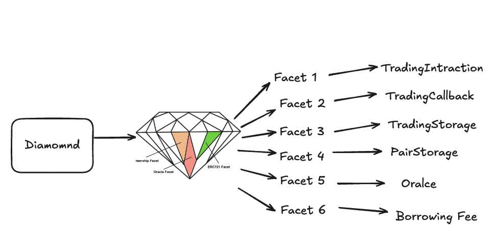

## Perp Protocol — Modular Perpetual Futures System

A fully modular, upgradeable, and collateral-flexible decentralized perpetual futures protocol built for performance and security.


### 🧩 Overview

Perp Protocol is a diamond-standard based perpetual futures engine designed to support multi-collateral trading, accurate price impact accounting, and flexible leverage structures. 

This repo showcases a deep exploration of gas-efficient smart contract engineering and DeFi composability.


The architecture is implemented using Solidity and [EIP-2535](https://eips.ethereum.org/EIPS/eip-2535) (Diamond Pattern), allowing modular separation of concerns across facets like order execution, price impact tracking, fee accruals, and liquidation logic.





### 🔧 Core Features

\- **Diamond Architecture (EIP-2535)** — Modular, upgradeable, and separation of core logic

\- **Multi-Collateral Support** — Traders can open positions using multiple collateral assets

\- **Price Impact Tracking** — Rolling OI windows and real-time impact-based price adjustments

\- **Borrowing Fees** — Time-weighted position fee model with support for grouped fee accruals

\- **Callback-Based Order Execution** — Median price handling via oracles and delayed trigger callbacks

\- **Liquidation Engine** — Dynamic liquidation price calculation based on margin + borrowing + price impact

\- **Trigger Orders & Rewards** — Gasless automation with on-chain incentives for execution

\- **Governance Hooks** — Controlled parameter updates via role-based access control


### \## ⚙️ Code Structure

```bash
src/
└── core/
    ├── MultiCollatDiamond.sol       # Diamond entry point
    ├── facets/
    │   ├── TradingCallbacks.sol     # Price callback + order handling
    │   ├── BorrowingFees.sol        # Borrowing fee and OI tracking
    │   ├── PriceImpact.sol          # Price impact windows & depths
    │   ├── TriggerRewards.sol       # Trigger rewards & execution windows
    ├── abstract/                    # Diamond logic: Loupe, Cut, Storage
```


### **🧠 Technical Highlights**

| **Feature**                  | **Description**                                              |
| ---------------------------- | ------------------------------------------------------------ |
| 🧱 **Diamond Facets**         | Code split by logical concern; upgradable without affecting storage layout |
| 💸 **OI-Based Fees**          | Rolling window logic to assess open interest and dynamically adjust fees |
| 🔮 **Oracle Callback Design** | All orders executed based on post-oracle median prices to avoid manipulation |
| 🛠️ **Governance-First**       | On-chain roles (GOV, MANAGER) restrict permissioned setters to ensure protocol safety |
| 🌐 **Multi-Collateral**       | Each pair and position supports flexible collateral indexing |


### **🚀 Getting Started**

**1. Install Dependencies**

```shell
forge install
```


**2. Compile**

```
forge build
```


**2. Run Tests**

```
forge test
```


### **🧪 Development Goals**

This project was designed to:

* Explore **modular DeFi architecture** with the diamond pattern
* Implement a **gas-efficient perp engine** with complete multi-collateral support
* Showcase production-grade **access control and state management**


### **📄 License**

MIT License


### **🤝 Connect**

Made with ❤️ by Baice

GitHub: `https://github.com/libaice/perp-protocol`


